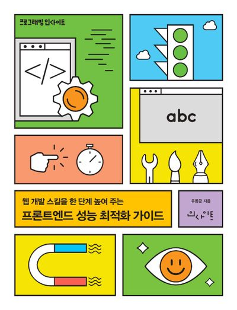

# 😎 INDEX

읽은 책들을 기록합니다.

<table> 
 <tr> 
  <td align="center"> <a href="refactoring-2nd/" >리팩터링 2판</a></td> 
  <td align="center"> <a href="effective-typescript/">이펙티브 타입스크립트</a></td> 
  <td align="center"> <a href="growing-up-together/">함께 자라기</a></td> 
 </tr>
  <tr> 
  <td align="center"> <a href="core-javascript/">코어 자바스크립트</a></td> 
  <td align="center"> <a href="frameworkless-frontend-development/">프레임워크 없는 프론트엔드 개발</a></td> 
  <td align="center"> <a href="frontend-performance-optimization-guide/">프론트엔드 성능 최적화 가이드</a></td> 
 </tr>
</table>

